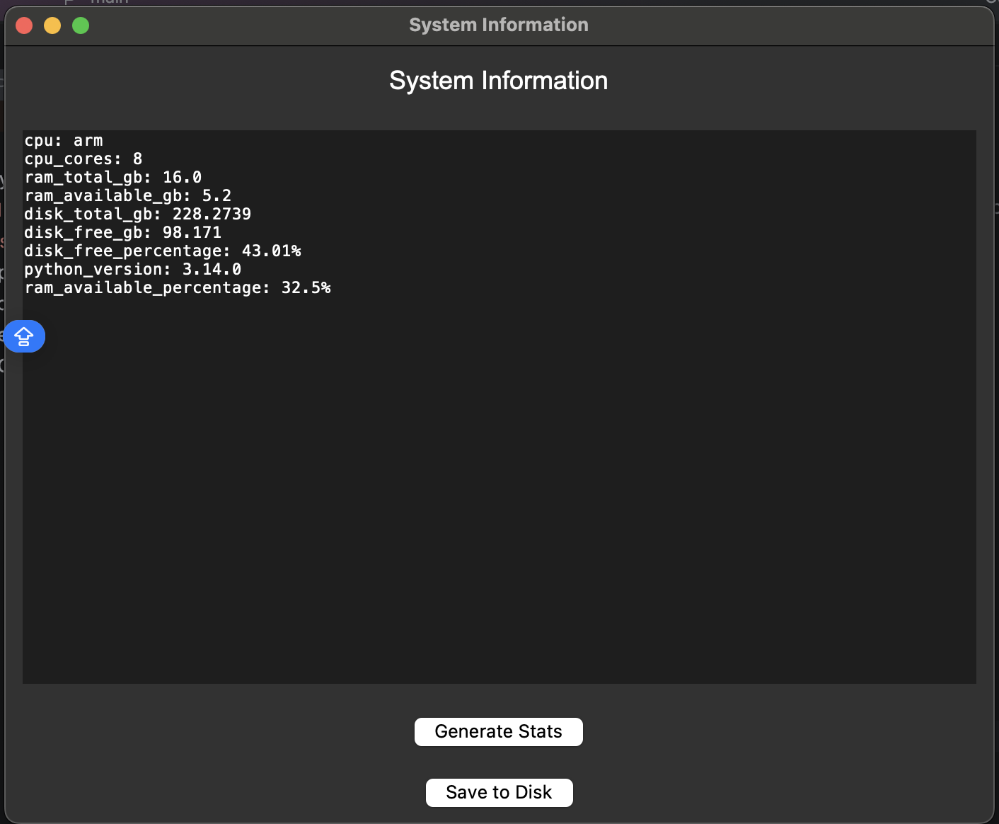

# SystemInfo

A small Tkinter desktop app that displays a snapshot of the local machine's system stats and lets you save it to a text file.

## Features

- Displays CPU name and core count
- Displays total/available RAM and available RAM percentage
- Displays total/free/used disk space and free disk percentage
- Displays the running Python version
- Saves the generated report to a timestamped `.txt` file

## Requirements

- Python 3
- [`psutil`](https://pypi.org/project/psutil/)

Install the dependency:

```bash
pip install -r requirements.txt
```

## Usage

Run the app:

```bash
python main.py
```

1. Click **Generate Stats** to populate the text box with current system information.
2. Click **Save to Disk** to write the contents of the text box to a file named `stat_information_<timestamp>.txt` in the project folder.

## UI Overview



- **Title bar** — "System Information", the app window's heading.
- **Text box** — the main output area. Starts empty; after clicking **Generate Stats**, it lists each stat as a `key: value` line (`cpu`, `cpu_cores`, `ram_total_gb`, `ram_available_gb`, `disk_total_gb`, `disk_free_gb`, `disk_free_percentage`, `python_version`, `ram_available_percentage`).
- **Generate Stats button** — refreshes the text box with a fresh snapshot from `get_system_info()`.
- **Save to Disk button** — dumps the current text box contents to a timestamped `.txt` file in the project folder, without clearing the display.

## Project Structure

| File | Description |
| --- | --- |
| `main.py` | Entry point; builds the Tkinter GUI (title, text box, buttons). |
| `tkfunctions.py` | GUI callbacks — `refresh_data` (populates the text box) and `save_to_disk` (writes it to a file). |
| `systemutils.py` | `get_system_info()` — collects CPU, RAM, disk, and Python version stats. |
| `nadavutils.py` | Small helpers for converting bytes to gigabytes and calculating percentages. |
| `requirements.txt` | Python dependencies (`psutil`). |
| `assets/` | Static assets used by this README (e.g. the UI screenshot). |
| `.gitignore` | Excludes `__pycache__/`, `.venv/`, `.idea/`, and generated `stat_information_*.txt` files. |
